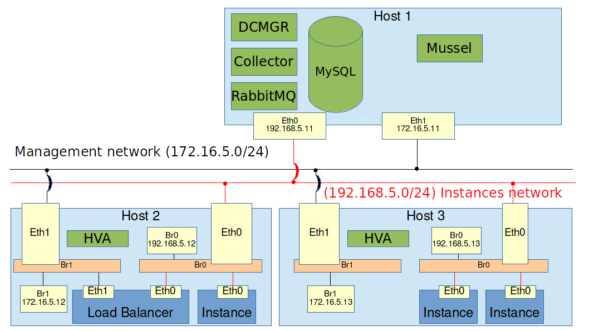

# Examination

## Assignment

You will be provided this environment.

#### Host 1

* **Eth0** is attached to the **instances** network with IP address `192.168.5.11`.
* **Eth1** is attached to the **management** network with IP address `172.16.5.11`.

#### Host 2

* **Eth0** is attached to the **instances** network with IP address `192.168.5.12`.
* **Eth1** is attached to the **management** network. No IP address set yet.

#### Host 3

* **Eth0** is attached to the **instances** network with IP address `192.168.5.13`.
* **Eth1** is attached to the **management** network. No IP address set yet.

The assignment is to create the following:

#### Part 1: Install and configure Wakame-vdc

3 hosts will be provided. Install the following in each host.

#### Host 1

* Dcmgr
* Collector
* RabbitMQ
* Mysql
* Mussel

#### Host 2

* HVA

You will need to set up the bridges so both instances and load balancer can work here.

#### Host 3

* HVA

You will need to set up the bridges so both instances and load balancer can work here.

#### Part 2: Set up instances

The machine images are provided in `~/images` on Host 2 and Host 3. They are the same images used in the exercises.

The instances do **not** need to be the same as shown on the illustation above. They can be on any HVA.

##### Ex 1: Instance and security groups

* Create 1 instance. It can be either lbnode or ubuntu.
* Use security groups to open tcp port 22 and 80.

##### Ex 2: Load Balancing

* Create a load balancer with 2 lbnode instances registered. Use tcp port 80 just like the exercises.

##### Ex 3: Auto scaling

- Every day at 17:00 create 3 more instances and register them to the load balancer from Ex 2.
- Every day at 22:00, shut those 3 instances down again.
