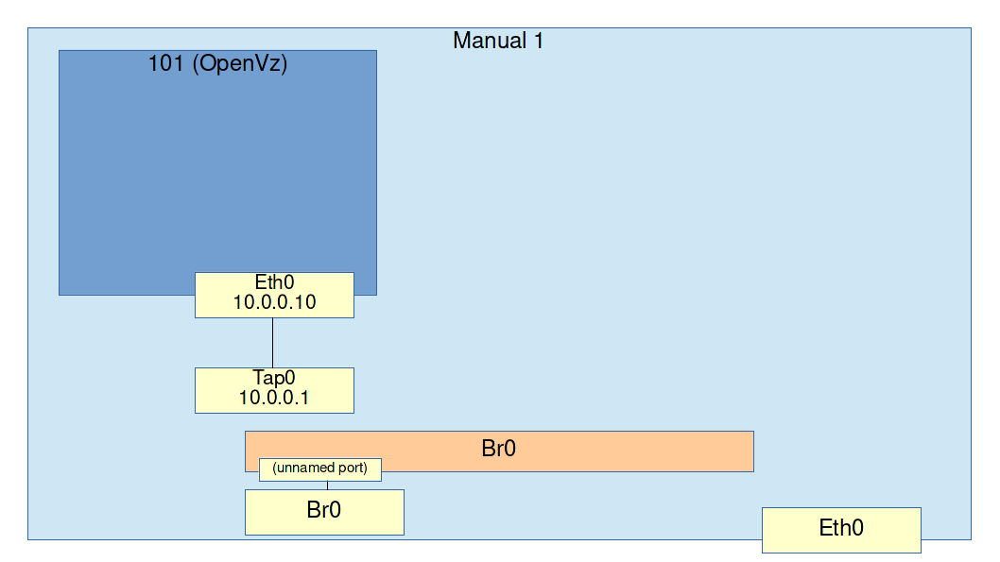
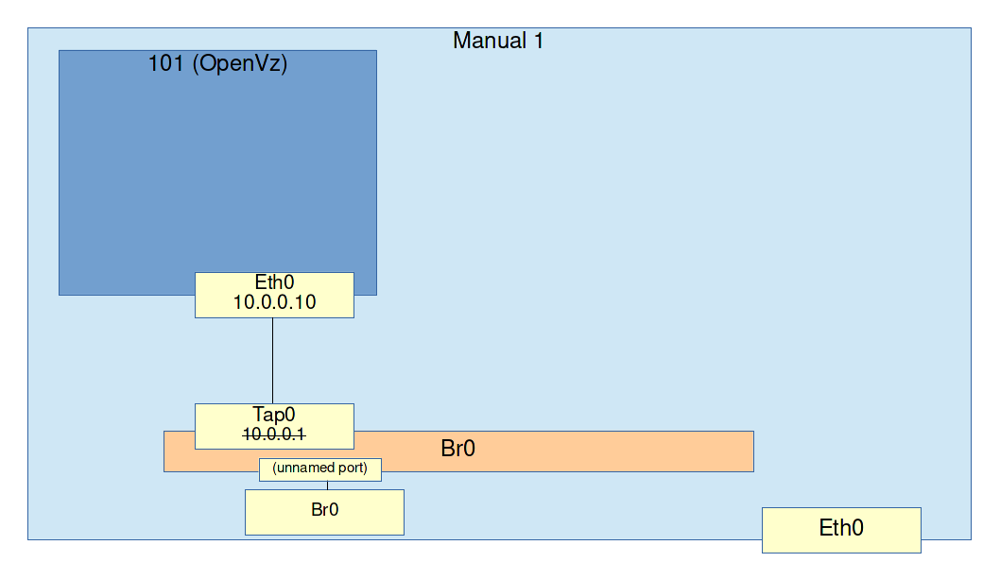
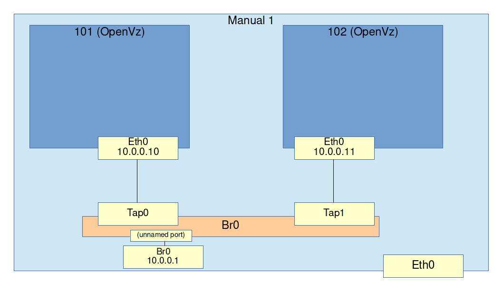

## Exercise: Multiple guests and bridged networking

In this exercise we will create a second guest and connect both guests and the host together using a bridge. Make sure you finish the previous exercise first because this one will continue where it left off.

The previous exercise was an example of L1 networking. Two machines with NICs connected directly to each other are able to exchange data. When you want to create a network with more than two machines in it, you need a bridge. A bridge is a device with multiple ports that take data (ethernet frames) coming in on one port, and sends them out every other port.

The machines connected to the bridge use MAC addresses to filter out ethernet frames addressed to them. All traffic will arrive everywhere, but the machines will only open up frames addressed to them.

You should still be logged into the machine labeled **Manual1**.

If you are still inside of the guest (101), exit it using the `exit` command.

On the host (Manual1), create a bridge with the following command.

```
sudo brctl addbr br0
```

This command does two things:

* It creates a new bridge called `br0`

* It creates a new NIC on the host which is also called `br0`



What we are going to do next is *enslave* `tap0` to the bridge. This means `tap0` will no longer be a NIC but rather a *port* in the bridge.

```
sudo brctl addif br0 tap0
```

Now let's try to ping the host again from the guest. You will see that it no longer works.

```
sudo vzctl enter 101
ping 10.0.0.1
```

All traffic that is received on `tap0` is now no longer opened by the OS, but forwarded to every other *port* on the bridge. Any IP address assigned to `tap0` will now be ignored.

Currently there is only one other *port* and connected to that is the host's NIC *br0*. We must assign an IP address to *br0* instead of *tap0* now.

Exit the container

```
exit
```

Now remove the IP address from `tap0` and assign it to `br0` instead.

```
sudo ip addr del 10.0.0.1/24 dev tap0

sudo ip addr add 10.0.0.1/24 dev br0
sudo ip link set br0 up
```



Now that we have a bridge, we can create a second guest (102) and attach that to `br0` as well.

```
sudo vzctl create 102 --ostemplate centos-6-x86_64-minimal --config basic

sudo bash -c "echo 'NETIF=\"ifname=eth0,bridge=br0,mac=10:54:FF:00:00:02,host_ifname=tap1,host_mac=10:54:FF:00:01:02\"' >> /etc/vz/conf/102.conf"

sudo vzctl start 102
sudo brctl addif br0 tap1
```

Enter the new guest (102) and assign an IP address to it.

```
sudo vzctl enter 102

ip addr add 10.0.0.11/24 dev eth0
```



The new guest (102) should now be able to ping both the other guest (101) and the host (Manual1).

```
ping 10.0.0.1

ping 10.0.0.10
```
