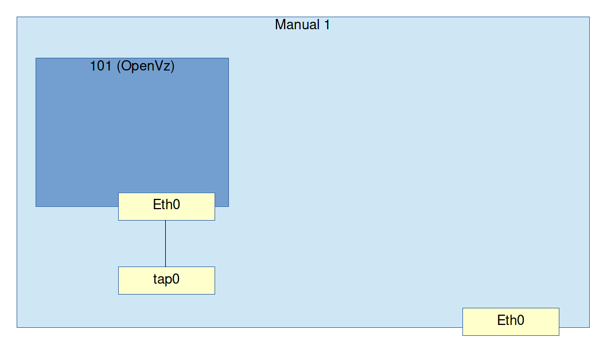
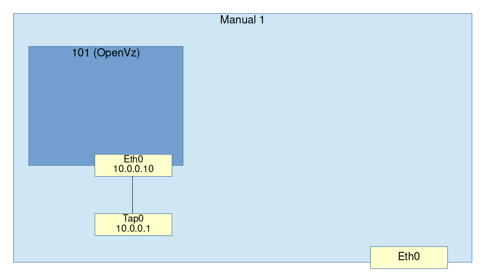

# Workshop 1: Manual Bridged VMs

## Goals

* Understand how instances are started
* Understand how bridged networking works
* Basically understand what Wakame-vdc does behind the scenes.

## Exercise: Start guest and connect from host

Networking works the same for pretty much any VM hypervisor. Today we will use OpenVz.

For the first exercise we will do a very simple setup with one guest that has a direct network connection to the host.

* Use an ssh client to log into the machine labeled **Manual1**

* A OpenVz template called `centos-6-x86_64-minimal` should already be prepared inside of this machine. Create a new instance of it.

```
sudo vzctl create 101 --ostemplate centos-6-x86_64-minimal --config basic
```

This will create a new OpenVz guest called *101* which is not started yet. Before we start it, we are going to add a network interface (NIC) to it.

```
sudo bash -c echo "'NETIF=\"ifname=eth0,bridge=br0,mac=10:54:FF:00:00:01,host_ifname=tap0,host_mac=10:54:FF:00:01:01\"' >> /etc/vz/conf/101.conf"
```

The above line tells the OpenVz guest to create a *veth pair* when it starts up. That means it will create a NIC on the host (Manual1) called `tap0` which is connected directly to the NIC `eth0` on the guest (101). You can imagine this as if there's a network cable with one end plugged into the host and the other end plugged into the guest.



Let's start the guest and see the new NIC get created on the host.

```
sudo vzctl start 101
```

Running `ip addr show` will show you the newly created NIC called `tap0`.

```
1: lo: <LOOPBACK,UP,LOWER_UP> mtu 16436 qdisc noqueue state UNKNOWN 
    link/loopback 00:00:00:00:00:00 brd 00:00:00:00:00:00
    inet 127.0.0.1/8 scope host lo
    inet6 ::1/128 scope host 
       valid_lft forever preferred_lft forever
2: eth0: <BROADCAST,MULTICAST,UP,LOWER_UP> mtu 1500 qdisc pfifo_fast state UP qlen 1000
    link/ether 52:54:00:12:34:70 brd ff:ff:ff:ff:ff:ff
    inet 192.168.3.100/24 brd 192.168.3.255 scope global eth0
    inet6 fe80::5054:ff:fe12:3470/64 scope link 
       valid_lft forever preferred_lft forever
3: venet0: <BROADCAST,POINTOPOINT,NOARP,UP,LOWER_UP> mtu 1500 qdisc noqueue state UNKNOWN 
    link/void 
    inet6 fe80::1/128 scope link 
       valid_lft forever preferred_lft forever
4: tap0: <BROADCAST,MULTICAST,UP,LOWER_UP> mtu 1500 qdisc noqueue state UNKNOWN 
    link/ether 10:54:ff:00:01:01 brd ff:ff:ff:ff:ff:ff
    inet 10.0.0.1/24 scope global tap0
    inet6 fe80::1254:ffff:fe00:101/64 scope link 
       valid_lft forever preferred_lft forever
```

This NIC called `tap0` is connected directly to the *101* container's NIC: `eth0`.

We can test network connectivity between the host (Manual1) and the guest (101) by assigning an IP address to both of their NICs. Let's do the host first.

```
sudo ip link set tap0 up
sudo ip addr add 10.0.0.1/24 dev tap0
```

Now let's enter the guest and assign an IP address there as well.

```
sudo vzctl enter 101
ip link set eth0 up
ip addr add 10.0.0.10/24 dev eth0
```



You should now be able to ping the host and vice versa.

```
ping 10.0.0.1
```
