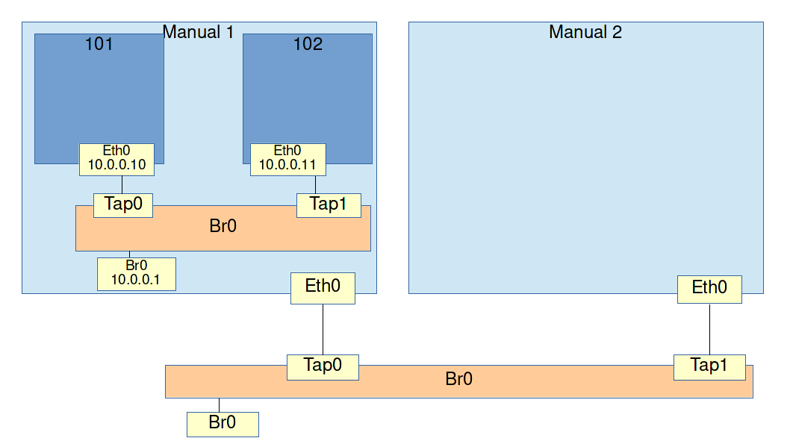
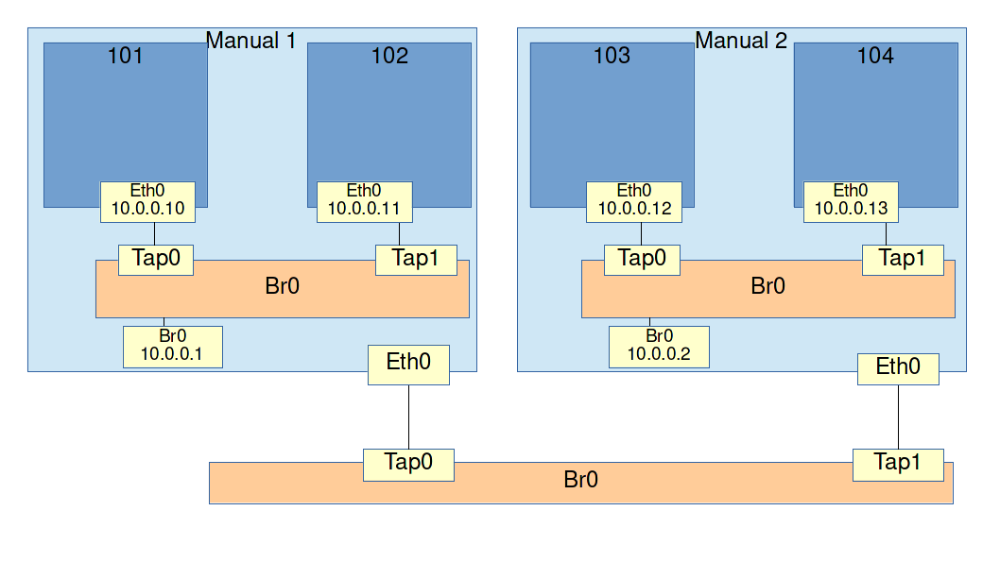
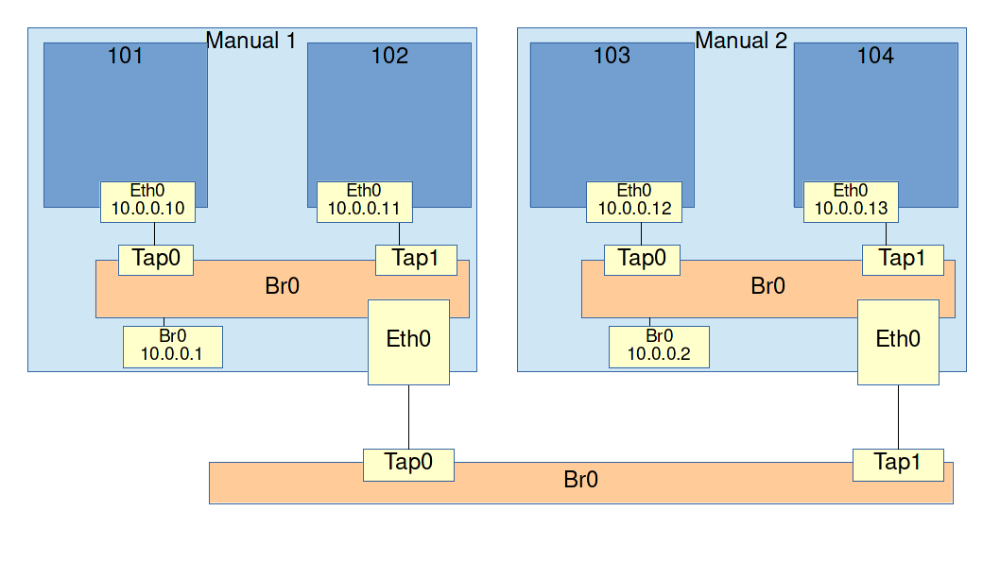

# Exercise: Bridged networking with multiple hosts and guests

## Goals

* Understand that a bridge broadcasts traffic
* Understand that connecting multiple bridges together creates 1 big bridge

## Assignment

Now that we have learned to set up bridged networking with 2 guests in 1 host, the next step is to connect multiple hosts. For this exercise, a second host labeled **Manual2** has been prepared. Just like the 2 guests (101 and 102) in the previous exercise are connected using a bridge, the two hosts (Manual1 and Manual2) are also connected on a bridge.



The assignment is to create 4 OpenVz containers on 2 hosts and connect all 4 of them in one broadcast domain.

Create 2 new OpenVz containers in Manual 2 and connect them to a bridge just like we did in the last exercise.

```
sudo vzctl create 103 --ostemplate centos-6-x86_64-minimal --config basic
sudo bash -c "echo 'NETIF=\"ifname=eth0,mac=10:54:FF:00:00:03,host_ifname=tap0,host_mac=10:54:FF:00:01:03\"' >> /etc/vz/conf/103.conf"

sudo vzctl create 104 --ostemplate centos-6-x86_64-minimal --config basic
sudo bash -c "echo 'NETIF=\"ifname=eth0,mac=10:54:FF:00:00:04,host_ifname=tap1,host_mac=10:54:FF:00:01:04\"' >> /etc/vz/conf/104.conf"

sudo vzctl start 103
sudo vzctl start 104

sudo brctl addbr br0
sudo ip link set br0 up
sudo ip addr add 10.0.0.2/24 dev br0

sudo brctl addif br0 tap0
sudo brctl addif br0 tap1

sudo vzctl enter 103
ip link set eth0 up
ip addr add 10.0.0.12/24 dev eth0
exit

sudo vzctl enter 104
ip link set eth0 up
ip addr add 10.0.0.13/24 dev eth0
exit
```



Now we have 2 hosts, 4 guests and 3 bridges. The only thing left to do is connect them.

Connecting two bridges together is done by simply connecting a port on one bridge to a port on another bridge. On a physical bridge, you'd just plug in a cable. On our virtual environment you can see that the `eth0` NICs on **Manual1** and **Manual2** are already connected to the outside bridge.

Therefore, to connect our 3 bridges together, just turn the hosts' `eth0` NICs into ports in their bridges.

On **Manual1** run:

```
sudo brctl addif br0 eth0
sudo ip link set eth0 up
```

Now run the same on **Manual2**:

```
sudo brctl addif br0 eth0
sudo ip link set eth0 up
```



Now every host and guest should be able to ping one another.
