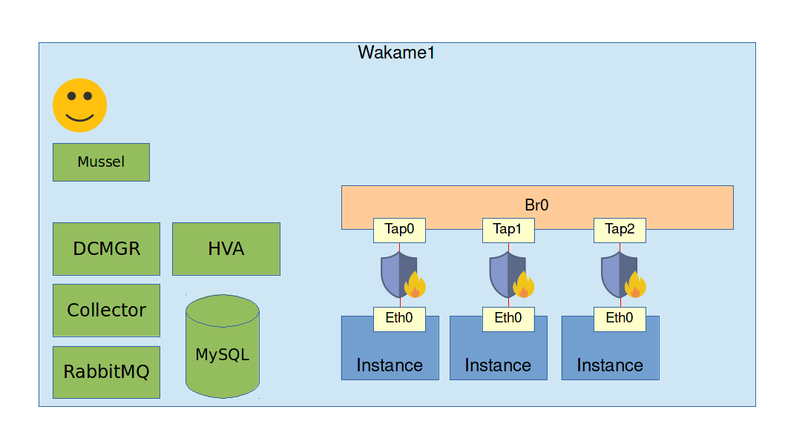
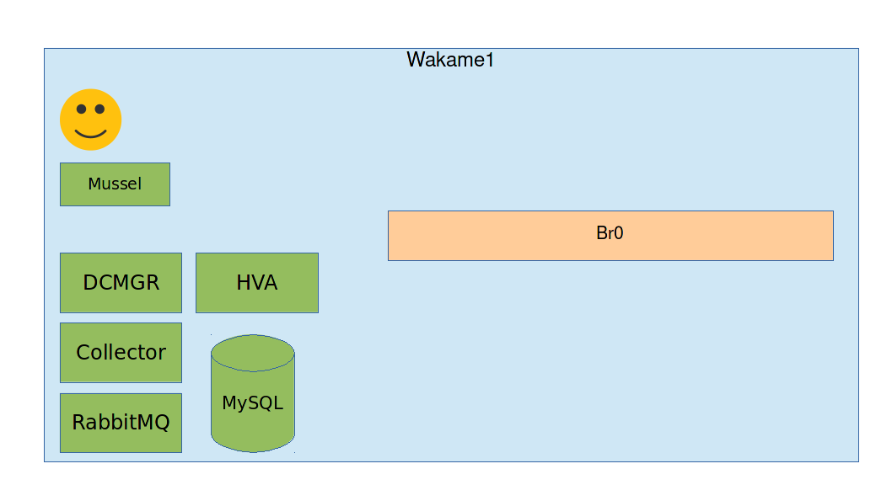

# Exercise: Install Wakame-vdc in one host

## Goals

* Learn how to set up and use Wakame-vdc
* Get the simplest working Wakame-vdc setup

## Assignment

Use your ssh client to log into the machine labeled `Wakame1`.

Wakame-vdc is designed to be distributed running on multiple servers and communicating through the network but it can also run with all components installed on one server. That is the setup we are going to create right now.



### Yum repository setup

We will use the Redhat package manager `yum` to install Wakame-vdc. We will have to set up some repositories so `yum` knows where to download its packages from.

**Remark:** These yum repositories are already set up in the image and the packages are pre-cached to avoid unnecessary download times. These steps are here for completeness but you can skip to Installation.

First add Axsh's Wakame-vdc yum repository.

```
sudo curl -o /etc/yum.repos.d/wakame-vdc-stable.repo -R https://raw.githubusercontent.com/axsh/wakame-vdc/master/rpmbuild/yum_repositories/wakame-vdc-stable.repo
```

Wakame-vdc can work with OpenVz, KVM and LXC. Today we'll be working with OpenVz. Set up OpenVz's yum repository as well and tell the OS to trust it by assing its GPG key.

```
sudo curl -o /etc/yum.repos.d/openvz.repo -R https://raw.githubusercontent.com/axsh/wakame-vdc/develop/rpmbuild/yum_repositories/openvz.repo

sudo rpm --import http://download.openvz.org/RPM-GPG-Key-OpenVZ
```

Finally install the epel repository. This contains several dependencies for Wakame-vdc.

```
sudo yum install -y epel-release
```

### Installation

First let's install the `wakame-vdc-dcmgr-vmapp-config` package. This contains both **DCMGR** and **Collector**.

**RabbitMQ** and **MySQL** will be installed along with it as dependencies.

```
sudo yum install -y wakame-vdc-dcmgr-vmapp-config
```

Next install HVA. There's 3 versions of it. One for OpenVz, one for LXC and one for KVM. The contents of the HVA package itself are exactly the same. Only the dependencies are different. We are going to install the OpenVz version.

```
sudo yum install -y wakame-vdc-hva-openvz-vmapp-config
```

Finally install the `mussel` client. This is a CLI that we will use to send commands to Wakame-vdc's Web API aka DCMGR.

```
sudo yum install -y wakame-vdc-client-mussel
```

### Reboot

OpenVz uses a custom Linux kernel. We need to reboot to load it.

```
sudo reboot
```

### Set up bridged networking

Now we are going to create a bridge just like we did in the previous workshop. Unlike the previous workshop, we are going to set up a network script that makes sure the bridge is created every time on boot.

Create the file `/etc/sysconfig/network-scripts/ifcfg-br0` with the following contents

```
DEVICE=br0
TYPE=Bridge
BOOTPROTO=static
ONBOOT=yes
NM_CONTROLLED=no
IPADDR=192.168.4.10
NETMASK=255.255.255.0
GATEWAY=192.168.4.1
DNS1=8.8.8.8
DELAY=0
```

Bring the bridge up with the following command.

```
sudo ifup br0
```

This has done essentially the same as the bridge setup exercises in the last workshop. Only this time the bridge will be created automatically on every boot.

### Configuration

Copy over the default Wakame-vdc configuration files to their correct locations.

```
sudo cp /opt/axsh/wakame-vdc/dcmgr/config/dcmgr.conf.example /etc/wakame-vdc/dcmgr.conf
sudo cp /opt/axsh/wakame-vdc/dcmgr/config/hva.conf.example /etc/wakame-vdc/hva.conf
```

Start MySQL and create the Wakame-vdc database.

```
sudo service mysqld start
mysqladmin -uroot create wakame_dcmgr
```

Now that we have the database, next we have to create the tables in it. We can use [Rake](https://github.com/ruby/rake) to create the database tables. Wakame-vdc comes with its own ruby binary that includes Rake.

```
cd /opt/axsh/wakame-vdc/dcmgr
/opt/axsh/wakame-vdc/ruby/bin/rake db:up
```

Wakame-vdc recognises host nodes by their *node id*. That is a unique id that AMQP uses to identify each service. We will assign the id demo1 to our HVA.

Edit the file `/etc/default/vdc-hva` and uncomment the following line:

```
NODE_ID=demo1
```

Add the HVA to Wakame-vdc's database. We can use the `vdc-manage` tool for this.

```
/opt/axsh/wakame-vdc/dcmgr/bin/vdc-manage host add hva.demo1 \
   --uuid hn-demo1 \
   --display-name "demo HVA 1" \
   --cpu-cores 100 \
   --memory-size 10240 \
   --hypervisor openvz \
   --arch x86_64 \
   --disk-space 102400 \
   --force
```

Next we will need to set up machine images. Some machine images should already be prepared in your home directory. Move them to a more suitable location.

```
mv ~/images /var/lib/wakame-vdc/
```

Next we are going to add many records to Wakame-vdc's database. We will use `vdc-manage` in interactive mode. That way it only needs to make a database connection once, resulting in less overhead.

```
/opt/axsh/wakame-vdc/dcmgr/bin/vdc-manage
```

Now we have an interactive vdc-manage shell. First we are going to tell Wakame-vdc where to find machine images.

```
backupstorage add \
  --uuid bkst-local \
  --display-name "local storage" \
  --base-uri "file:///var/lib/wakame-vdc/images/" \
  --storage-type local \
  --description "storage on the local filesystem"
```

Next we are going to register our images with Wakame-vdc. This is a two step process.

First we register a *backup object*. This is basically a hard drive image.

```
backupobject add \
  --uuid bo- \
  --display-name "ubuntu 14.04.3 passwd login enabled" \
  --storage-id bkst-local \
  --object-key ubuntu-14.04.3-x86_64-30g-passwd-login-enabled.raw.tgz \
  --container-format tgz \
  --size=312530432 \
  --allocation-size=312530604 \
  --checksum=81bb27d621f2d1e90ce24625a1dcb311
```

Next we a machine image. This is an extra database record that tells Wakame-vdc that this backup object is a bootable image that we can launch instances of.

```
image add local bo-ubuntu14043ple \
  --account-id a-shpoolxx \
  --uuid wmi-ubuntu14043ple \
  --root-device label:root \
  --display-name "ubuntu 14.04.3 passwd login enabled"
```

Next we are going to register a network that instances can be started in. If you like at the bridge setup, you'll might notice that we set IP address 192.168.4.100/24 for it. This is also the network we are going to start instances in.

```
network add \
  --uuid nw-demo1 \
  --ipv4-network 192.168.4.0 \
  --prefix 24 \
  --ipv4-gw 192.168.4.1 \
  --dns 8.8.8.8 \
  --account-id a-shpoolxx \
  --display-name "demo network"
```

Wakame-vdc is now aware of this network but it still doesn't know which IP addresses in it are available to assign to instances. Register a dhcp range.

```
network dhcp addrange nw-demo1 192.168.4.50 192.168.4.200
```

```
macrange add 525400 1 ffffff --uuid mr-demomacs
```

Finally, Wakame-vdc needs to know that instances startedin network `nw-demo1` need to be attached to bridge `br0`.

In `/etc/wakame-vdc/hva.conf` there is the following line.

```
dc_network('public') {
  bridge_type 'linux'
  interface 'eth0'
  bridge 'br0'
}
```

Note how this says that this associates *dc_network* `public` with bridge `br0`. If we create a *dc_network* in the database called `public` and assign our network `nw-demo1` to it, every instance in `nw-demo1` will be connected to `br0`.

```
network dc add public --uuid dcn-public --description "the network instances are started in"
network dc add-network-mode public securitygroup
network forward nw-demo1 public
```

We are done with `vdc-manage` now. Exit its shell.

```
exit
```

### Start Wakame-vdc

We have to start all Wakame-vdc components before we can begin using it. If you followed this guide, MySQL should already be started but let's include it here just to be sure.

```
sudo service mysqld start
```

Next start RabbitMQ so the Wakame-vdc components can communicate using AMQP.

```
sudo service rabbitmq-server start
```

Now start the Wakame-vdc processes themselves.

```
sudo start vdc-dcmgr
sudo start vdc-collector
sudo start vdc-hva
sudo start vdc-webui
```

We have now effectively created the following environment.


