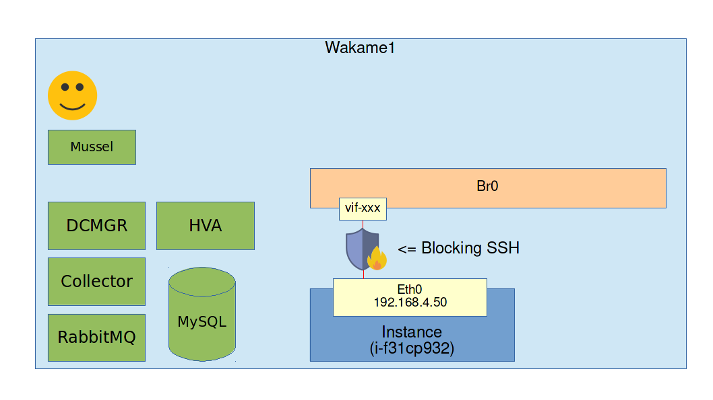

# Exercise: Start and terminate instances

## Goals

* Learn of to use Wakame-vdc to create and destroy instances on the fly

## Assignment

You should still be logged into the machine labeled `Wakame1`. If not, use your ssh client to log into it.

We are going to use the `mussel` client that we have installed in the last exercise. Run the following command to show all the instances currently on Wakame-vdc.

```
mussel instance index
```

This will show you that there are 0 instances. That is correct. We haven't started any instances yet.

We can also use `mussel` to show the network and machine image we have registered in the previous exercise.

```
mussel network index
mussel image index
```

Before we can start instances, we will have to register an ssh key pair. This key pair will later be used to log into our instances.

There should already be a key pair prepared in your home directory.

* Private key: `~/ssh_key_pair/demo_key.pem`
* Public key: `~/ssh_key_pair/demo_key.pem.pub`

```
mussel ssh_key_pair create --display-name "demo key" --public-key ~/ssh_key_pair/demo_key.pem.pub
```

This should give you output similar to this:

```
---
:id: ssh-hzfltyzd
:account_id: a-shpoolxx
:uuid: ssh-hzfltyzd
:finger_print: 10:8a:e4:3f:cb:83:ae:0e:75:90:0a:32:14:ed:c2:20
:public_key: |
  ssh-rsa AAAAB3NzaC1yc2EAAAABIwAAAgEA3A7VjdBHCvWWfQ0hyjaVKBD/TktSot9SJvp5vKzrrohwK4vITgyzLp2S+n4Ujw4h3C5rGh/QE5+YmGGzuHjksTApX5ZkcZtUr2m0Jo4kF2EY9CbvWDd3AXMu9JdaYLm9KquVYaecrSHo3CMOHJdn5IeTPpVMY8Q/X5AlWVcmG4yJexstzodAis/QzSey5WLNP0NalyxYEplkIyqeGGK4FxKNLdTdGZc/mo1gFvjaMaapr4Qi8zqcKzcyJ/eiL2rh2xjndeEU9o1JQX0UeS8S8V0PZaD/jeMBzRGeP3tuqGKn1KPrUW2ElveMD/RcuTQhuHSIy3FnOQ+xCn9xYqYAzOOgCgMlJXCHFgG1iuZhWCZeDxx1h8JWaMj+Ohalzk/vMxndbY4+SsEl2+okWHacmxEX1N9b8fDUv+H/cGK4Hs1D/7X5zh+Jg4wuTO8AyIqK77BuYysho8zqXvFz7qL/TUoNrk/UwcTOZYoC0bdKdNuAuw/hp3txQgx2tRVTY84I+ZfCxgVNthZ1IqKPjUPC82/sihxusvTMD4322k9RvqZaQJrzJWTt0ltAUIxCr592yN7OUN5AsRuUFHrg2IRDOBTWtkvivREbbAOhn52+ZQYXEwqUIRXFvdZX5VY6G+IbPom6vqKaz+IFeBMzKV3EdlHXs5xzyIFiKGF34530PCU= centos@joske
:description: ''
:created_at: 2016-09-02 10:04:25.000000000 Z
:updated_at: 2016-09-02 10:04:25.000000000 Z
:service_type: std
:display_name: demokey
:deleted_at: 
:labels: []
```

Make note of the `id` line. In this example it is `ssh-hzfltyzd` but it will be something else for you. We are going to need this later so write it down.

If you ever forget, you can use the following command to check it.

```
mussel ssh_key_pair index
```

Now that we have an SSH key pair set up, we are able to start an instance.

```
echo '{"eth0":{"network":"nw-demo1"}}' > /tmp/vifs.json

mussel instance create \
  --cpu-cores 1 \
  --hypervisor openvz \
  --image-id wmi-ubuntu14043ple \
  --memory-size 256 \
  --ssh-key-id ssh-hzfltyzd \
  --vifs /tmp/vifs.json \
  --display-name "my first instance"

rm /tmp/vifs.json
```

The output of this command should be similar to this.

```
---
:id: i-f31cp932
:account_id: a-shpoolxx
:host_node: 
:cpu_cores: 1
:memory_size: 256
:arch: x86_64
:image_id: wmi-ubuntu14043ple
:created_at: 2016-09-04 07:28:13.000000000 Z
:updated_at: 2016-09-04 07:28:13.076308328 Z
:terminated_at: 
:deleted_at: 
:state: scheduling
:status: init
:ssh_key_pair:
  :uuid: ssh-hzfltyzd
  :display_name: demokey

--snip--
```

Again make note of the **id** line. This is the unique ID that Wakame-vdc uses to identify your instance. In this example it is `i-f31cp932` but it will be something else for you.

Check the state of your instance.

```
mussel instance show i-f31cp932 | grep -e '^:state'
```

We need the state to be `running`. If it says `scheduling`, `pending` or `initializing` then the instance is still starting up. Wait a few seconds and try again. If it says `terminated` then something went wrong. Check the files in `/var/log/wakame-vdc` for errors.

Once we have reached state running, our instance is ready.

You will be able to log into your instance using vzctl.

```
sudo vzctl enter i-f31cp932
```

However, logging in with vzctl is not the way to use Wakame-vdc. Usually you will want to have network connectivity to your instances and log into them from a remote location. Exit the instance again.

```
exit
```

Let's see what IP address Wakame-vdc has assigned to our instance.

```
mussel instance show i-f31cp932
```

In the output, find the part that looks like this:

```
:vif:
- :vif_id: vif-se50xbbh
  :network_id: nw-demo1
  :ipv4:
    :address: 192.168.4.50
    :nat_address: 
  :security_groups: []
```

Back when we created the instance, we provided `{"eth0":{"network":"nw-demo1"}}` as the vifs parameter. VIFs stands for virtual interfaces. It's the NICs we want the instance to have. We told it we want one interface and connect it to network `nw-demo1`.

The output of the above command shows us that the instance indeed has a NIC that is connected to network `nw-demo1` and has IP address `192.168.4.50`. In order to log into the instance, we need to use SSH with the key pair registered before.

```
ssh -i ~/ssh_keys/demo_key.pem ubuntu@192.168.4.50
```

While this is the correct command, you will notice that you can not establish an SSH connection to the instance. Why is that? Because of the firewall.



Wakame-vdc's firewall is implemented using iptables and ebtables. You can see the exact rules applied using the following commands.

```
sudo iptables-save
sudo ebtables-save
```

There is also an option to use [OpenVNet](http://axsh.jp/openvnet/) instead to manage networking including firewalls but that is beyond the scope of this training.

By default **all incoming network traffic is blocked.** To change this you have to add *security groups* to the instance's NICs. First of all let's create a security group that opens tcp port 22, the SSH port for every source IP address.

```
mussel security_group create --rule "tcp:22,22,ip4:0.0.0.0"
```

The output should look like this. Again make note of the id. `sg-wavx6zxz` in the example.

```
---
:id: sg-wavx6zxz
:account_id: a-shpoolxx
:uuid: sg-wavx6zxz
:created_at: 2016-09-04 08:24:01.000000000 Z
:updated_at: 2016-09-04 08:24:01.000000000 Z
:description: 
:rule: tcp:22,22,ip4:0.0.0.0
:service_type: std
:display_name: ''
:labels: []
:rules:
- :ip_protocol: tcp
  :ip_fport: 22
  :ip_tport: 22
  :protocol: ip4
  :ip_source: 0.0.0.0/0
```

Now that we have the security group, we have to place the instance's NIC in it. First find the unique ID of the instance's NIC.

Again look at the output we got from the `mussel instance show i-f31cp932` command.

```
:vif:
- :vif_id: vif-se50xbbh
  :network_id: nw-demo1
  :ipv4:
    :address: 192.168.4.50
    :nat_address: 
  :security_groups: []
```

The `vif_id` part shows us the unique ID we need. In this case it is `vif-se50xbbh`.

Now place NIC `vif-se50xbbh` in security group `sg-wavx6zxz` with the following command. Make sure to replace the example IDs with the ones in your environment.

```
mussel network_vif add_security_group vif-se50xbbh --security_group_id sg-wavx6zxz
```

Now port 22 has opened in the firewall and we should be able to SSH into the instance.

```
ssh -i ~/ssh_keys/demo_key.pem ubuntu@192.168.4.50
```

For more information on security groups, read [the guide on wakame-vdc.org](http://wakame-vdc.org/security-groups/).

Now's a good time to play around with Wakame-vdc a bit, creating more instances and security groups. Once you're done with them you can delete them using commands like this.

```
mussel instance destroy i-f31cp932
mussel security_group destroy sg-wavx6zxz
```

You could also try [installing the GUI](03_gui.md)
