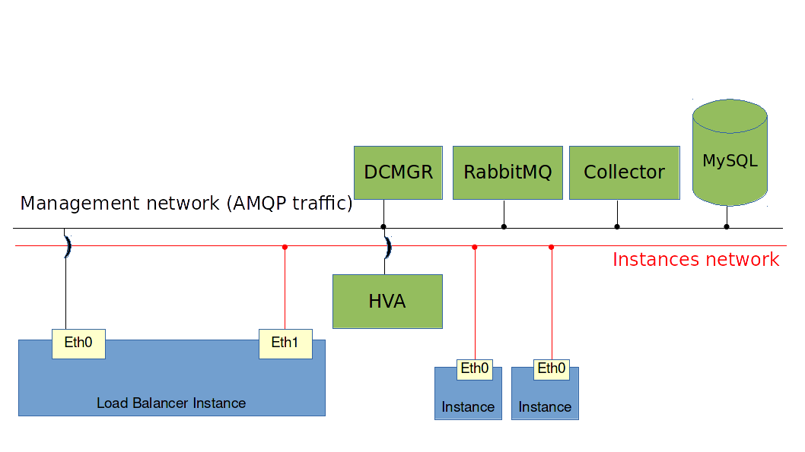
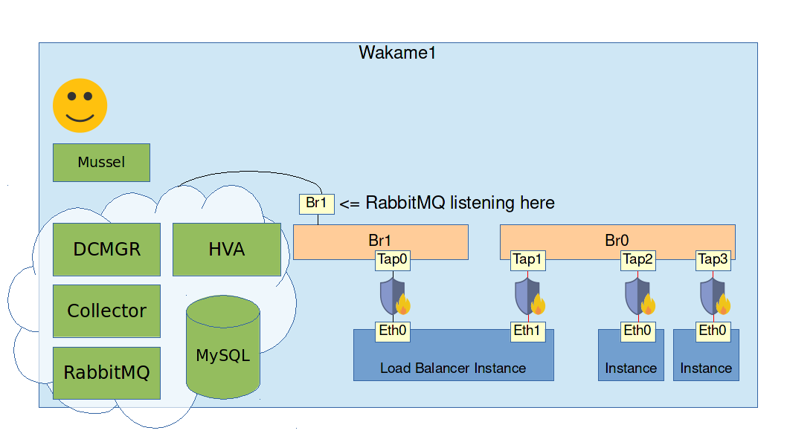

# Exercise: Load balancing

## Goals

* Learn how to set up Wakame-vdc's load balancers

## Assignment

Wakame-vdc's load balancing feature is actually a special instance running [haproxy](http://www.haproxy.org). This instance will have two NICs that will each be connected to a different network. Those two networks are:

* The instances network

  This is the one we configured last in the [previous workshop](../workshop_02_vdc_1host/01_installation.md). All instances are connected to this. The load balancer needs to be connected to it too so it can pass traffic on to the other instances.

* The management network

  This is the network on which RabbitMQ, DCMGR and the other Wakame-vdc components are listening. The load balancer needs to have access to this network because Wakame-vdc will sends it commands over AMQP. For example if a new instance gets registered to this load balancer, Wakame-vdc will automatically apply the correct configuration this way.





First let's set up this new network. We should still be logged into the machine labeled **Wakame1**. If not, log into it with your SSH client.

First let's set up the management network. Create the file `/etc/sysconfig/network-scripts/ifcfg-br1` with the following contents:

```
DEVICE=br1
TYPE=Bridge
BOOTPROTO=static
ONBOOT=yes
NM_CONTROLLED=no
IPADDR=172.16.0.21
NETMASK=255.255.255.0
DNS1=8.8.8.8
DELAY=0
```

This will create a new bridge called `br1` every time the server boots. Since we don't want to reboot right now, we can bring it up with the following command:

```
sudo ifup br1
```

We will use this bridge and subnet 172.16.0.0/24 as our management network. Register it using `vdc-manage`.

```
/opt/axsh/wakame-vdc/dcmgr/bin/vdc-manage network add \
  --uuid nw-mngmnt \
  --ipv4-network 172.16.0.0 \
  --prefix 24 \
  --account-id a-shpoolxx \
  --service-type lb \
  --display-name "management network"

/opt/axsh/wakame-vdc/dcmgr/bin/vdc-manage network dhcp addrange nw-mngmnt 172.16.0.50 172.16.0.200
```

Notice the option `--service-type lb`. This tells Wakame-vdc that this network is intended for load balancders. When using the GUI, it will not be offered as a network to start regular instances in.

Now that we have the network added, we have to make sure that instances in this network get attached to the bridge **br1**.

In `/etc/wakame-vdc/hva.conf` find the part that looks like this.

```
dc_network('management') {
  bridge_type 'linux'
  interface 'eth1'
  bridge 'br1'
}
```

We have seen this before in the previous workshop. We have to create a `dc_network` named management and assign network `nw-mngmnt` to it.

```
/opt/axsh/wakame-vdc/dcmgr/bin/vdc-manage

network dc add management --uuid dcn-management --description "The management line"
network dc add-network-mode management passthrough
network forward nw-mngmnt management
```

Next we will registere the machine image. As we mentioned before, the load balancer is really just an instance running [haproxy](http://www.haproxy.org). The machine image for this special instance was provided on the **Wakame1** VM.

If you followed the instructions in [01_installation.md](01_installation.md) correctly, it should be located at `/var/lib/wakame-vdc/images/lb-centos6.6-stud.x86_64.openvz.md.raw.tar.gz`

Register it to the Wakame-vdc database using `vdc-manage`. We have to register the load balancer in a similar way we registered machine images in the previous workshop. First register the backup object. (= hard drive image)

```
backupobject add \
  --storage-id=bkst-local \
  --uuid=bo-haproxy1d64 \
  --display-name='lb-centos6.6-stud.x86_64.openvz.md.raw.tar.gz' \
  --object-key=lb-centos6.6-stud.x86_64.openvz.md.raw.tar.gz \
  --size=2147483648 \
  --allocation-size=470420388 \
  --checksum=cafbe29e468be992e49b68285bb759db \
  --container-format=tgz \
  --description='lb-centos6.6-stud.x86_64.openvz.md.raw.tar.gz'
```

Next we add the machine image which again means that this backup object is bootable as an instance.

```
image add local bo-haproxy1d64 \
  --account-id a-shpoolxx \
  --uuid wmi-haproxy1d64 \
  --arch x86_64 \
  --description 'lb-centos6.6-stud.x86_64.kvm.md.raw.tar.gz local' \
  --file-format raw \
  --root-device label:root \
  --service-type lb \
  --is-public \
  --display-name 'haproxy1d64' \
  --is-cacheable
```

Notice again that the `service type` is set to `lb` this time. That will tell Wakame-vdc to treat this image as a load balancer.

We are done with `vdc-manage` now.

```
exit
```

Next open `/etc/wakame-vdc/dcmgr.conf` in a text editor.

Find the part that looks like this.

```
service_type("lb", "LbServiceType") {
  image_id 'wmi-demolb'
  instances_network 'nw-demo1'
  management_network 'nw-demo8'
  host_node_scheduler :LeastUsage
  storage_node_scheduler :LeastUsage
  network_scheduler :VifsRequestParam
  mac_address_scheduler :ByHostNodeGroup do
    default 'mr-demomacs'

    pair 'hng-shhost', 'mr-range1'
  end

  # Please specify the addresses that can be referenced from within an instance of the load balancer.
  # amqp_server_uri is saved to userdata in instance of the load balancer.
  amqp_server_uri 'amqp://example.com/'
}
```

This is where the configuration for the load balancer is set. Let's walk through it line by line.

```
  image_id 'wmi-demolb'
```

First we have this line. Like we mentioned before, the load balancer is really just another instance. That's why Wakame-vdc needs to know which machine image to use for it. This line tells Wakame-vdc to use the image with uuid `wmi-demolb` when starting a load balancer.

However, there currently is not image with `wmi-demolb` registered. Instead, we have just registered a machine image with uuid `wmi-haproxy1d64`. We have to tell Wakame-vdc to use this one.

Change the line to look like this:

```
  image_id 'wmi-haproxy1d64'
```

Next let's take a look at the following two lines.

```
  instances_network 'nw-demo1'
  management_network 'nw-demo8'
```

These lines tell Wakame-vdc which networks to use as the instances network and management network respectively when starting instances.

The instances network line is correct since in the previous workshop, we created a network with uuid `nw-demo1` and are already using that to start instances in.

The `management_network` line will need to be changed. In this workshop we have created a management network with uuid `nw-mngmnt `. Fill it in here.

```
  management_network 'nw-mngmnt'
```

It is possible to set these to the same network but that will mean that all instances will also have access to RabbitMQ and the Wakame-vdc Web API. Only do this if there is no untrusted parties accessing the instances.

Next we have the scheduler lines.

```
  host_node_scheduler :LeastUsage
  storage_node_scheduler :LeastUsage
  network_scheduler :VifsRequestParam
  mac_address_scheduler :ByHostNodeGroup do
    default 'mr-demomacs'

    pair 'hng-shhost', 'mr-range1'
  end
```

This configuration is used by collector when assigning the HVA, storage, network, IP Address and MAC address to assign to the load balancers. We do not need to change it.

Finall there is this line.

```
  amqp_server_uri 'amqp://example.com/'
```

This line tells load balancers where they can find RabbitMQ. In our environment RabbitMQ is running on the **Wakame1** machine and we have just set up **Wakame1** with a NIC in the management network that has IP address `172.16.0.21`. Fill in that IP address here.

```
  amqp_server_uri 'amqp://172.16.0.21/'
```

Restart DCMGR and Collector to load the changed configuration file.

```
sudo restart vdc-dcmgr
sudo restart vdc-collector
```

The final contents should look something like this:

```
service_type("lb", "LbServiceType") {
  image_id 'wmi-haproxy1d64'
  instances_network 'nw-demo1'
  management_network 'nw-mngmnt'
  host_node_scheduler :LeastUsage
  storage_node_scheduler :LeastUsage
  network_scheduler :VifsRequestParam
  mac_address_scheduler :ByHostNodeGroup do
    default 'mr-demomacs'

    pair 'hng-shhost', 'mr-range1'
  end

  # Please specify the addresses that can be referenced from within an instance of the load balancer.
  # amqp_server_uri is saved to userdata in instance of the load balancer.
  amqp_server_uri 'amqp://172.16.0.21/'
}
```

Unfortunately there is currently a bug in Wakame-vdc causing a configuration file required by load balancers not to be in the correct place. The following commands will fix that.

```
cd /opt/axsh/wakame-vdc/dcmgr/config/convert_specs/
sudo rm load_balancer.yml
sudo cp load_balancer.yml.example load_balancer.yml
```

You are now ready to start your first load balancer.

```
mussel load_balancer create \
  --balance-algorithm leastconn \
  --display-name "my_first_load_balancer" \
  --instance_port 80 \
  --instance_protocol http \
  --max_connection 1000 \
  --port 80 \
  --protocol http
```

The output should look similar to this:

```
:id: lb-o5osuocx
:uuid: lb-o5osuocx
:account_id: a-shpoolxx
:instance_id: i-22dpge8q
:instance_protocol: http
:instance_port: 80
:balance_algorithm: leastconn
:cookie_name: 
:description: ''
:private_key: ''
:public_key: ''
:created_at: 2016-09-05 09:40:11.000000000 Z
:updated_at: 2016-09-05 09:40:11.000000000 Z
:deleted_at: 
:display_name: my_first_load_balancer
:allow_list:
- 0.0.0.0
:httpchk_path: ''
:state: scheduling
:status: init
:target_vifs: []
:vif: []
:inbounds:
- :port: 80
  :protocol: http
```

Again make note of the `id` (or `uuid`) line. In the example it's `lb-o5osuocx`. Use it to check the state of your load balancer.

```
mussel load_balancer show lb-o5osuocx | grep -e '^:state'
```

We need the state to be `running`. If it says `scheduling`, `pending` or `initializing` then the load balancer is still starting up. Wait a few seconds and try again. If it says `terminated` then something went wrong. Check the files in `/var/log/wakame-vdc` for errors.

Once we have reached state `running`, our load balancer is ready.

Check the load balancer's IP address in the instances network.

```
mussel load_balancer show lb-o5osuocx


:id: lb-o5osuocx
:uuid: lb-o5osuocx
:account_id: a-shpoolxx
:instance_id: i-22dpge8q
:instance_protocol: http
:instance_port: 80
:balance_algorithm: leastconn
:cookie_name: 
:description: ''
:private_key: ''
:public_key: ''
:created_at: 2016-09-05 09:40:11.000000000 Z
:updated_at: 2016-09-05 09:40:11.000000000 Z
:deleted_at: 
:display_name: my_first_load_balancer
:allow_list:
- 0.0.0.0
:httpchk_path: ''
:state: scheduling
:status: init
:target_vifs: []
:vif:
- :vif_id: vif-8ls6d5m3
  :vif_index: 0
  :network_id: nw-demo1
  :ipv4:
    :address: 192.168.4.51 # <= This is what we're looking for.
    :nat_address: 
- :vif_id: vif-e5o9oomj
  :vif_index: 1
  :network_id: nw-mngmnt
  :ipv4:
    :address: 172.16.0.50
    :nat_address: 

:inbounds:
- :port: 80
  :protocol: http
```

Try making a http request to that IP address.

```
curl 192.168.4.51
```

The output should be this.

```
<html><body><h1>503 Service Unavailable</h1>
No server is available to handle this request.
</body></html>
```

That means your load balancer is working as expected. It just doesn't have any instances registered to it yet. To get that taken care of, move on to the [next exercise](02_lb_node.md).
