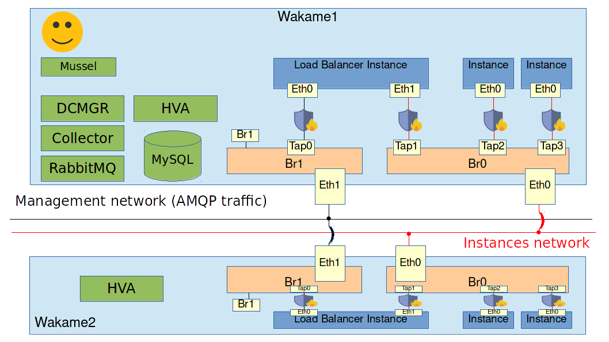

# Exercise: Wakame-vdc on multiple hosts

## Goals

* Learn how to setup Wakame-vdc with multiple HVA hosts

## Assignment

We are going to add a second HVA to our Wakame-vdc setup. When we start instances, collector will decide which HVA they are started on. By default this is the HVA that is currently being used the least.

When we're done with the exercise, we will have an environment similar to this image.




You should still be logged into the machine labeled `Wakame1`. If not, use your ssh client to log into it.

First of all we have to add `eth1` to the bridge `br1`. That is because when using multiple hosts, we have to make sure that both hosts have access to the management network and the instances network. There is no need to add `eth0` to `br0` because we have already done that when installing.


Create the file `/etc/sysconfig/network-scripts/ifcfg-eth1` with the following contents.

```
DEVICE="eth1"
ONBOOT="yes"
BRIDGE=br1
NM_CONTROLLED=no
```

Now bring up the interface.

```
sudo ifup eth1
```

Running brctl should now show us that it's enslaved to `br1`.

```
sudo brctl show br1
bridge name     bridge id               STP enabled     interfaces
br1             8000.0018516fc2f3       no              eth1 # <== This is what we want to see.
                                                        vif-e5o9oomj
```

We're done with Wakame1 for now. Use your SSH client to log into **Wakame2**.

We are going to install HVA here much in the same way we installed it in Wakame1. First set up the yum repositories.

```
sudo curl -o /etc/yum.repos.d/wakame-vdc-stable.repo -R https://raw.githubusercontent.com/axsh/wakame-vdc/master/rpmbuild/yum_repositories/wakame-vdc-stable.repo

sudo curl -o /etc/yum.repos.d/openvz.repo -R https://raw.githubusercontent.com/axsh/wakame-vdc/develop/rpmbuild/yum_repositories/openvz.repo

sudo rpm --import http://download.openvz.org/RPM-GPG-Key-OpenVZ

sudo yum install -y epel-release
```

Install HVA.

```
sudo yum install -y wakame-vdc-hva-openvz-vmapp-config
```

Reboot to load the OpenVz kernel.

```
sudo reboot
```

Set up the bridge for the instances network just like before. Create the file `/etc/sysconfig/network-scripts/ifcfg-br0` with the following contents

```
DEVICE=br0
TYPE=Bridge
BOOTPROTO=static
ONBOOT=yes
NM_CONTROLLED=no
IPADDR=192.168.4.22
NETMASK=255.255.255.0
GATEWAY=192.168.4.1
DNS1=8.8.8.8
DELAY=0
```

Next we need to enslave `eth0` to the bridge. Modify the file `/etc/sysconfig/network-scripts/ifcfg-eth0` with the following contents.

```
DEVICE="eth0"
ONBOOT="yes"
BRIDGE=br0
NM_CONTROLLED=no
```

Now do the same for bridge `br1` and NIC `eth1`.

Create `/etc/sysconfig/network-scripts/ifcfg-br1` with the following contents.

```
DEVICE=br1
TYPE=Bridge
BOOTPROTO=static
ONBOOT=yes
NM_CONTROLLED=no
IPADDR=172.16.0.22
NETMASK=255.255.255.0
DNS1=8.8.8.8
DELAY=0
```

Create `/etc/sysconfig/network-scripts/ifcfg-eth1` with the following contents.

```
DEVICE="eth1"
ONBOOT="yes"
BRIDGE=br1
NM_CONTROLLED=no
```

Triple check the values in these files and restart the network.

```
sudo service network restart
```

Copy the configuration file to its proper location.

```
sudo cp /opt/axsh/wakame-vdc/dcmgr/config/hva.conf.example /etc/wakame-vdc/hva.conf
```

Edit the file `/etc/default/vdc-hva` and find the following line:

```
#NODE_ID=demo1
```

Like we said before, this is the *node id* that RabbitMQ uses to identify this HVA. We are already using `demo1` so let's uncomment it and change it to `demo2`.

```
NODE_ID=demo2
```

We also in to tell this HVA where RabbitMQ is running. In the same file, find the following line.

```
#AMQP_ADDR=127.0.0.1
```

Uncomment it and fill in the IP address of Wakame1 on the management network.

```
AMQP_ADDR=172.16.0.10
```

There should be some images prepared in your home directory just like in the Wakame1 machine. Copy them over the the right location.

```
sudo mv ~/images /var/lib/wakame-vdc/
```

Now exit Wakame2 and log into Wakame1 again. We need to register our new HVA using `vdc-manage`.

On **Wakame1**, run the following command.

```
/opt/axsh/wakame-vdc/dcmgr/bin/vdc-manage host add hva.demo2 \
   --uuid hn-demo2 \
   --display-name "demo HVA 2" \
   --cpu-cores 100 \
   --memory-size 10240 \
   --hypervisor openvz \
   --arch x86_64 \
   --disk-space 102400 \
   --force
```

Now exit Wakame1 and log into Wakame2 again.

On **Wakame2**, start HVA.

```
sudo start vdc-hva
```

Check if HVA has started ok. If everything went well, you should find something similar to this in `/var/log/wakame-vdc/hva.log`

```
D, [2016-09-07T21:19:51.533520 #2352] DEBUG -- ServiceNetfilter: Subscribing to: hva.demo2/vnic_created
I, [2016-09-07T21:19:51.533796 #2352]  INFO -- NetfilterCache: updating cache from database
D, [2016-09-07T21:19:51.534028 #2352] DEBUG -- ServiceNetfilter: Subscribing to: hva.demo2/vnic_destroyed
D, [2016-09-07T21:19:51.534911 #2352] DEBUG -- ServiceNetfilter: Subscribing to: broadcast/debug/vnet
2016-09-07 21:19:51 Node thr=#<Thread:0x007f609fd93d50> [INFO]: Started : AMQP Server=amqp://172.16.0.10/, ID=hva.demo2, token=eba45
```

Now try starting some instances. If everything went well, you should see that they are now being started on both Wakame1 and Wakame2 and all instances should be on the same network together. We have efficively created a VDC cloud.
